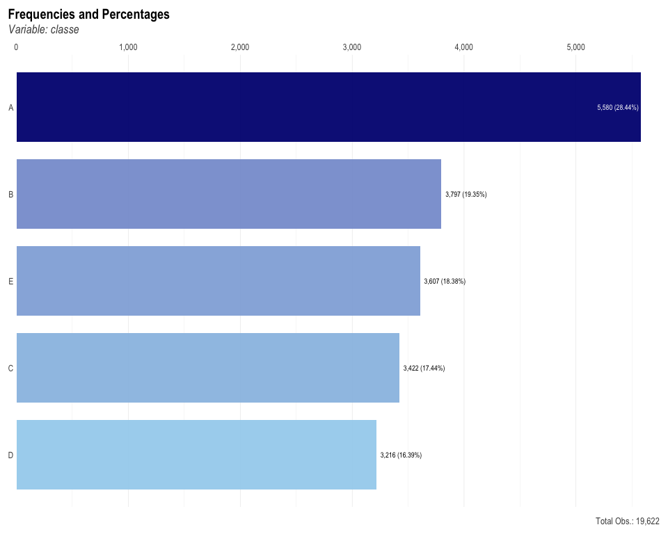
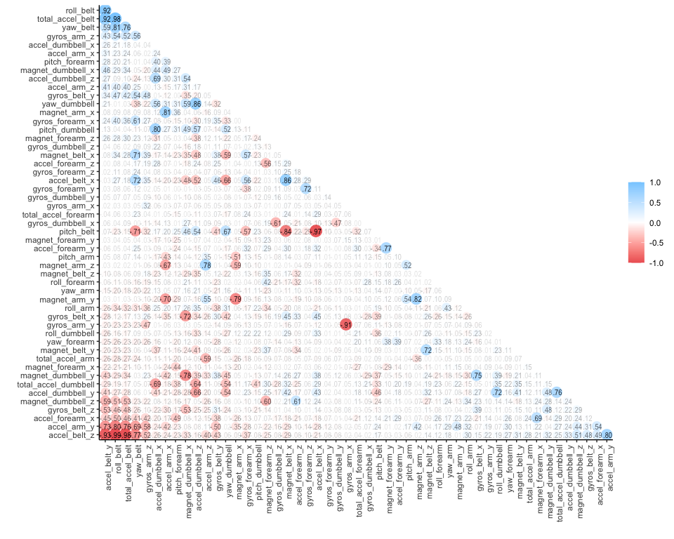
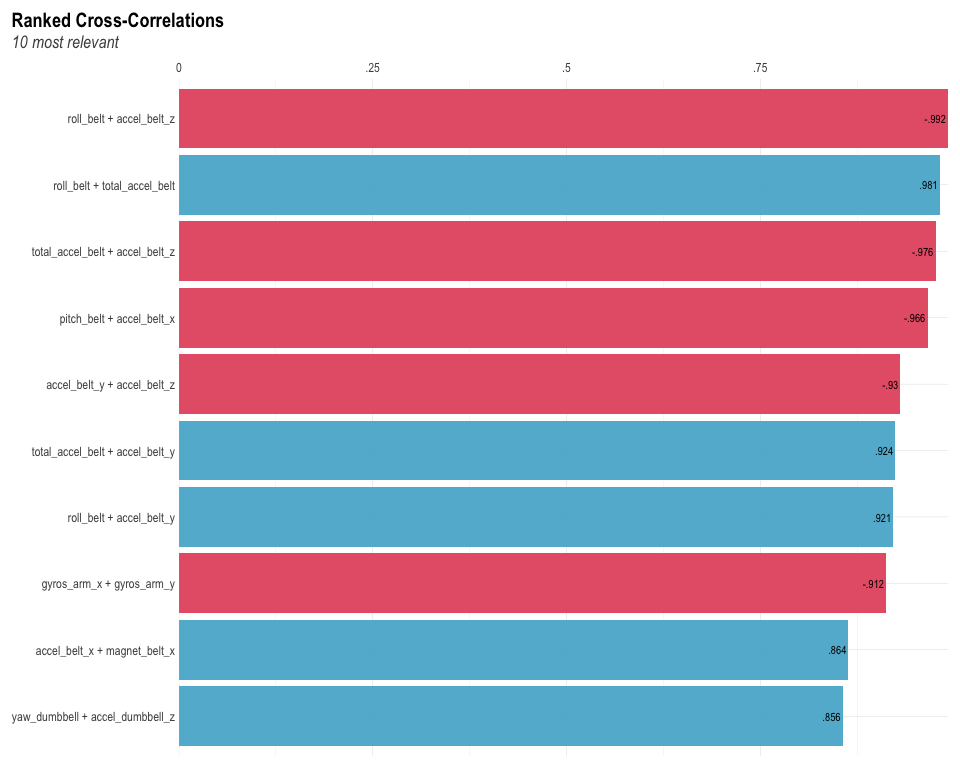

## I. Overview

We're all familiar with the ability of wearable technology to predict what kind of activities the wearer is performing, but we rarely see accurate predictions of how "well" the activity is being performed. In this machine learning prediction analysis, we explore data from a 2013 study, "Qualitative Activity Recognition of Weight Lifting Exercises", in which 6 participants were fitted with wearable sensors, and were instructed to perform unilateral dumbbell biceps curls in five different ways (mapped to the training dataset's `classe` variable):  

* Class A: Exactly according to the specifications (i.e. correct form).  
* Class B: Throwing the elbows to the front (incorrect form).  
* Class C: Lifing the dumbbell only halfway (incorrect form).  
* Class D: Lowering the dumbbel only halfway (incorrect form).  
* Class E: Throwing the hips to the front (incorrect form).  

Accelerometer readings were recorded and published in the study's publicly-accessible dataset. The goal of this analysis will be to examine the data to see if we can find any correlations between `classe` and the many different accelerometer readings, such that we can create a machine learning model that can accurately predict how well an activity is being performed. Links to the training and testing data can be found here:  

* Training Data: https://d396qusza40orc.cloudfront.net/predmachlearn/pml-training.csv.  
* Testing Data: https://d396qusza40orc.cloudfront.net/predmachlearn/pml-testing.csv.  

## II. Preprocessing

We begin by loading and cleaning the data. An initial dimension check of the training set reveals that there are 160 variables. We then proceed to inspect and clean the data, removing columns with missing data:  


``` r
training_data <- read.csv(
  file = "pml-training.csv", 
  na.strings = c("NA", "", "#DIV/0!")
)

testing_data <- read.csv(
  file = "pml-testing.csv",
  na.strings = c("NA", "", "#DIV/0!")
)

dim(training_data)
```

```
## [1] 19622   160
```

``` r
dim(testing_data)
```

```
## [1]  20 160
```


``` r
training_data <- training_data[, colMeans(is.na(training_data)) < 0.95]
testing_data <- testing_data[,  colMeans(is.na(testing_data)) < 0.95]

cols_to_rm <- c(
      "X",
      "user_name",
      "raw_timestamp_part_1",
      "raw_timestamp_part_2",
      "cvtd_timestamp",
      "new_window",
      "num_window",
      "...1"
)
training_data <- training_data[, !(names(training_data) %in% cols_to_rm)]
testing_data  <- testing_data[, !(names(testing_data) %in% cols_to_rm)]

training_data$classe <- as.factor(training_data$classe)

dim(training_data)
```

```
## [1] 19622    53
```

``` r
sum(is.na(training_data))
```

```
## [1] 0
```

``` r
dim(testing_data)
```

```
## [1] 20 53
```

``` r
sum(is.na(testing_data))
```

```
## [1] 0
```

After some initial cleaning we were able to reduce the number of variables from 160 to 53.

## III. Exploratory Data Analysis

In this next step, we dig into the data to explore correlations between variables in search of patterns or anomalies, so that we can further slice and refind the data before testing machine learning models. Our goal, as stated earlier, is to understand how the different accelerometer readings (our "features") relate to `classe` (our "outcome").  


``` r
library(lares)

training_data %>% freqs(classe, plot = T, results = F)
```

<!-- -->

The plot above shows the distribution of the `classe` variable, or as we learned eariler, the manner in which the exercise was performed. Class A, which represents correct form, has the highest distribution, with the other four more or less even.


``` r
num_cols <- training_data %>%
  select(where(is.numeric))

sampled_data <- num_cols %>% sample_n(size = 1962, replace = FALSE)

sampled_data %>%
      select(where(is.numeric)) %>%
      correlate() %>%
      rearrange(absolute = FALSE) %>%
      shave() ->
      sampled_cor

p <- rplot(sampled_cor, print_cor = TRUE)
p + theme(axis.text.x = element_text(angle = 90, hjust = 1))
```

<!-- -->

``` r
corr_cross(sampled_data, top = 10)
```

<!-- -->

The two charts above help visualize cross-correlations among variables. This is important because in some cases too many highly correlated features in a dataset--otherwise known as multicollinearity--can create redundancy and interfere with model training. Since we currently have 53 features, and only a small percent seem to be highly correlated, we'll keep all of them and will just steer away from models like Decision Trees, which don't handle a large number of features with potential multicollinearity as well as Random Forests or Gradient Boosting Machines.

## IV. Slicing the Data

Now that we've cleaned the data and selected the features that most relate to the outcome, we're ready to train our prediction models. We begin by slicing the data into a training portion and a validation (testing) portion:  


``` r
set.seed(7744)
data_split <- initial_split(training_data, prop = 3/4, strata = classe)
tr_set <- training(data_split)
v_set <- testing(data_split)
```

## V. Model Training & 5-Fold Repeated Cross-Validation

The first model that we trained is a Random Forest Model, which we set up with 5-fold cross-validation repeated 3 times:


``` r
model_recipe <- recipe(classe ~ ., data = tr_set) %>%
  step_nzv(all_predictors())

rf_spec <- rand_forest(
  mode = "classification",
  trees = 500
) %>%
set_engine("ranger", importance = "impurity")

rf_workflow <- workflow() %>%
  add_recipe(model_recipe) %>%
  add_model(rf_spec)

set.seed(7744)
rep_cv_split <- vfold_cv(
  data = tr_set,
  v = 5,
  repeats = 3,
  strata = classe
)

rf_results <- fit_resamples(
  rf_workflow,
  resamples = rep_cv_split,
  metrics = metric_set(accuracy, roc_auc),
  control = control_resamples(save_pred = TRUE)
)

cv_metrics <- rf_results %>% collect_metrics()

final_rf_fit <- fit(rf_workflow, data = tr_set)

valid_preds <- predict(final_rf_fit, v_set, type = "prob") %>%
  bind_cols(predict(final_rf_fit, v_set)) %>%
  bind_cols(v_set %>% select(classe))

valid_metrics <- valid_preds %>%
  metrics(truth = classe, estimate = .pred_class)

cv_metrics
```

```
## # A tibble: 2 × 6
##   .metric  .estimator  mean     n   std_err .config             
##   <chr>    <chr>      <dbl> <int>     <dbl> <chr>               
## 1 accuracy multiclass 0.992    15 0.000313  Preprocessor1_Model1
## 2 roc_auc  hand_till  1.00     15 0.0000259 Preprocessor1_Model1
```

``` r
valid_metrics
```

```
## # A tibble: 2 × 3
##   .metric  .estimator .estimate
##   <chr>    <chr>          <dbl>
## 1 accuracy multiclass     0.994
## 2 kap      multiclass     0.993
```

### Accuracy and Out-of-Sample Error Rate


``` r
cv_accuracy <- cv_metrics %>%
  filter(.metric == "accuracy") %>%
  pull(mean)

cv_accuracy
```

```
## [1] 0.9922302
```

``` r
out_of_sample_error <- 1 - cv_accuracy
out_of_sample_error
```

```
## [1] 0.007769812
```

Cross-validation results from the first model show that it achieves 99.22% accuracy on average. Consequently, the out-of-sample error is roughly 0.78%. In other words, when this model is applied to unseen data, it is likely to make an error only around 0.78% of the time. Even though these results are excellent, let's train some additional models to see if we can find even better accuracy.

### Additional Model Training


``` r
detach("package:lares")
library(h2o)

h2o.init()
```


``` r
train_h2o <- as.h2o(tr_set)
valid_h2o <- as.h2o(v_set)
test_h2o <- as.h2o(testing_data)
y <- "classe"
x <- setdiff(names(tr_set), y)

train_h2o[, y] <- as.factor(train_h2o[, y])
valid_h2o[, y] <- as.factor(valid_h2o[, y])

aml <- h2o.automl(
      x = x,
      y = y,
      training_frame    = train_h2o,
      leaderboard_frame = valid_h2o,
      max_runtime_secs  = 300,
      seed             = 7744
)
```


``` r
lb <- aml@leaderboard
lb
```

```
##                                                  model_id mean_per_class_error
## 1 StackedEnsemble_BestOfFamily_1_AutoML_1_20250220_224701          0.003163835
## 2    StackedEnsemble_AllModels_3_AutoML_1_20250220_224701          0.003374361
## 3    StackedEnsemble_AllModels_1_AutoML_1_20250220_224701          0.003374361
## 4    StackedEnsemble_AllModels_2_AutoML_1_20250220_224701          0.003374361
## 5 StackedEnsemble_BestOfFamily_4_AutoML_1_20250220_224701          0.003596091
## 6 StackedEnsemble_BestOfFamily_2_AutoML_1_20250220_224701          0.003596091
##       logloss       rmse         mse
## 1 0.008924942 0.04780262 0.002285091
## 2 0.010362501 0.05017208 0.002517238
## 3 0.009866801 0.05025355 0.002525420
## 4 0.009766178 0.05013228 0.002513246
## 5 0.011615503 0.05295360 0.002804083
## 6 0.011755102 0.05310792 0.002820451
## 
## [24 rows x 5 columns]
```

Using the `h2o` package, we trained and cross-validated a Gradient Boosting Machine (GBM) model, a Generalized Linear Model (GLM), and a Random Forest (DRF) model in order to create some Stacked Ensemble models, which combine the strengths of multiple base learning models in order to create a single, more robust predictive model. After creating the models shown above, the next step is to rank them and check metrics, so that we can compare the best model's predictive performance against the first model that we created earlier.  


``` r
best_model <- aml@leader
best_model
```

```
## Model Details:
## ==============
## 
## H2OMultinomialModel: stackedensemble
## Model ID:  StackedEnsemble_BestOfFamily_1_AutoML_1_20250220_224701 
## Model Summary for Stacked Ensemble: 
##                                    key            value
## 1                    Stacking strategy cross_validation
## 2 Number of base models (used / total)              1/2
## 3     # GBM base models (used / total)              1/1
## 4     # GLM base models (used / total)              0/1
## 5                Metalearner algorithm              GLM
## 6   Metalearner fold assignment scheme           Random
## 7                   Metalearner nfolds                5
## 8              Metalearner fold_column               NA
## 9   Custom metalearner hyperparameters             None
## 
## 
## H2OMultinomialMetrics: stackedensemble
## ** Reported on training data. **
## 
## Training Set Metrics: 
## =====================
## 
## MSE: (Extract with `h2o.mse`) 8.338026e-07
## RMSE: (Extract with `h2o.rmse`) 0.0009131279
## Logloss: (Extract with `h2o.logloss`) 0.0005399119
## Mean Per-Class Error: 0
## AUC: (Extract with `h2o.auc`) NaN
## AUCPR: (Extract with `h2o.aucpr`) NaN
## Null Deviance: (Extract with `h2o.nulldeviance`) 31887.96
## Residual Deviance: (Extract with `h2o.residual_deviance`) 10.84359
## AIC: (Extract with `h2o.aic`) NaN
## Confusion Matrix: Extract with `h2o.confusionMatrix(<model>,train = TRUE)`)
## =========================================================================
## Confusion Matrix: Row labels: Actual class; Column labels: Predicted class
##           A    B    C    D    E  Error         Rate
## A      2854    0    0    0    0 0.0000 =  0 / 2,854
## B         0 1943    0    0    0 0.0000 =  0 / 1,943
## C         0    0 1752    0    0 0.0000 =  0 / 1,752
## D         0    0    0 1637    0 0.0000 =  0 / 1,637
## E         0    0    0    0 1856 0.0000 =  0 / 1,856
## Totals 2854 1943 1752 1637 1856 0.0000 = 0 / 10,042
## 
## Hit Ratio Table: Extract with `h2o.hit_ratio_table(<model>,train = TRUE)`
## =======================================================================
## Top-5 Hit Ratios: 
##   k hit_ratio
## 1 1  1.000000
## 2 2  1.000000
## 3 3  1.000000
## 4 4  1.000000
## 5 5  1.000000
## 
## 
## 
## 
## 
## H2OMultinomialMetrics: stackedensemble
## ** Reported on cross-validation data. **
## ** 5-fold cross-validation on training data (Metrics computed for combined holdout predictions) **
## 
## Cross-Validation Set Metrics: 
## =====================
## 
## Extract cross-validation frame with `h2o.getFrame("levelone_training_StackedEnsemble_BestOfFamily_1_AutoML_1_20250220_224701")`
## MSE: (Extract with `h2o.mse`) 0.002558907
## RMSE: (Extract with `h2o.rmse`) 0.05058564
## Logloss: (Extract with `h2o.logloss`) 0.01141359
## Mean Per-Class Error: 0.003226572
## AUC: (Extract with `h2o.auc`) NaN
## AUCPR: (Extract with `h2o.aucpr`) NaN
## Null Deviance: (Extract with `h2o.nulldeviance`) 46736.79
## Residual Deviance: (Extract with `h2o.residual_deviance`) 335.9018
## AIC: (Extract with `h2o.aic`) NaN
## Hit Ratio Table: Extract with `h2o.hit_ratio_table(<model>,xval = TRUE)`
## =======================================================================
## Top-5 Hit Ratios: 
##   k hit_ratio
## 1 1  0.997146
## 2 2  0.999864
## 3 3  1.000000
## 4 4  1.000000
## 5 5  1.000000
## 
## 
## 
## 
## Cross-Validation Metrics Summary: 
##                                mean         sd  cv_1_valid  cv_2_valid
## accuracy                   0.997151   0.001767    0.998966    0.997200
## auc                              NA   0.000000          NA          NA
## err                        0.002849   0.001767    0.001034    0.002800
## err_count                  8.400000   5.224940    3.000000    8.000000
## logloss                    0.011391   0.004134    0.009008    0.009552
## max_per_class_error        0.009972   0.003948    0.004211    0.008734
## mean_per_class_accuracy    0.996772   0.001856    0.998811    0.996745
## mean_per_class_error       0.003228   0.001856    0.001189    0.003255
## mse                        0.002554   0.001146    0.001752    0.002233
## null_deviance           9347.357000 249.733150 9214.802000 9066.105000
## pr_auc                           NA   0.000000          NA          NA
## r2                         0.998827   0.000516    0.999219    0.998949
## residual_deviance         67.180360  24.837072   52.266910   54.582430
## rmse                       0.049655   0.010509    0.041858    0.047258
##                          cv_3_valid  cv_4_valid  cv_5_valid
## accuracy                   0.997968    0.994239    0.997381
## auc                              NA          NA          NA
## err                        0.002033    0.005761    0.002620
## err_count                  6.000000   17.000000    8.000000
## logloss                    0.008175    0.018373    0.011845
## max_per_class_error        0.012685    0.014467    0.009766
## mean_per_class_accuracy    0.997463    0.993764    0.997079
## mean_per_class_error       0.002537    0.006236    0.002921
## mse                        0.001701    0.004498    0.002586
## null_deviance           9341.785000 9377.016000 9737.078000
## pr_auc                           NA          NA          NA
## r2                         0.999210    0.997962    0.998798
## residual_deviance         48.266810  108.435030   72.350624
## rmse                       0.041246    0.067065    0.050848
```

As you can see from the results of our multinomial stacked ensemble model above, it has slightly outperformed our initial random forest model. The 5-fold cross validation results report an average accuracy of about 99.71%, up from the 99.22% achieved by our first model, and a mean per-class error of just around 0.00325.

The confusion matrix, shown below, compares predicted values to actual values. The results of our stacked ensemble model reveal only 1 misclassification in `classe` label class A, 4 in class B, 4 in class C, and 5 in class D, with class E showing no errors. Overall, the model has achieved almsot perfect classification with an extremely low error rate.


``` r
perf <- h2o.performance(best_model, newdata = valid_h2o)
h2o.confusionMatrix(perf)
```

```
## Confusion Matrix: Row labels: Actual class; Column labels: Predicted class
##           A   B   C   D   E  Error         Rate
## A      1394   0   0   0   1 0.0007 =  1 / 1,395
## B         1 946   3   0   0 0.0042 =    4 / 950
## C         0   4 852   0   0 0.0047 =    4 / 856
## D         0   0   5 799   0 0.0062 =    5 / 804
## E         0   0   0   0 902 0.0000 =    0 / 902
## Totals 1395 950 860 799 903 0.0029 = 14 / 4,907
```

## VI. Predictions for 20 Test Cases


``` r
final_predictions <- h2o.predict(best_model, test_h2o)
```

```
## 
  |                                                                            
  |                                                                      |   0%
  |                                                                            
  |======================================================================| 100%
```

``` r
head(final_predictions, 20)
```

```
##    predict            A            B            C            D            E
## 1        B 1.818154e-04 9.991061e-01 4.610331e-04 1.521302e-04 9.891315e-05
## 2        A 9.998107e-01 9.862974e-05 3.559020e-05 3.454709e-05 2.057188e-05
## 3        B 7.832073e-04 9.964119e-01 1.612817e-03 4.536905e-04 7.383743e-04
## 4        A 9.995393e-01 2.316203e-05 1.693623e-04 2.428268e-04 2.538023e-05
## 5        A 9.998629e-01 1.403447e-05 8.121945e-05 1.666857e-05 2.513762e-05
## 6        E 2.953519e-05 4.363416e-04 3.767481e-04 2.141526e-04 9.989432e-01
## 7        D 2.658753e-04 2.231927e-04 2.234559e-03 9.969171e-01 3.593191e-04
## 8        B 2.126752e-04 9.985916e-01 5.594613e-04 4.265557e-04 2.096847e-04
## 9        A 9.999727e-01 5.590071e-06 3.867894e-06 9.521666e-06 8.282115e-06
## 10       A 9.999359e-01 1.146214e-05 1.821906e-05 2.239491e-05 1.202634e-05
## 11       B 2.655816e-04 9.982792e-01 5.952637e-04 4.594100e-04 4.005307e-04
## 12       C 1.484959e-04 2.264532e-04 9.992723e-01 1.590995e-04 1.936654e-04
## 13       B 2.109934e-05 9.998948e-01 2.086857e-05 2.183160e-05 4.138679e-05
## 14       A 9.999797e-01 1.951559e-06 7.523193e-06 5.434423e-06 5.404910e-06
## 15       E 2.930827e-04 8.923263e-04 2.782853e-04 6.189740e-04 9.979173e-01
## 16       E 4.435199e-04 6.908977e-04 9.301005e-05 3.806075e-04 9.983920e-01
## 17       A 9.997372e-01 4.283088e-05 3.273098e-05 5.317370e-05 1.340203e-04
## 18       B 1.443981e-04 9.993508e-01 8.105443e-05 2.283728e-04 1.953357e-04
## 19       B 1.666974e-04 9.995273e-01 5.778717e-05 1.637511e-04 8.447728e-05
## 20       B 5.009487e-06 9.999406e-01 1.065621e-05 1.364452e-05 3.012439e-05
```


``` r
h2o.shutdown(prompt = FALSE)
```

## VII. References

1. Velloso, E.; Bulling, A.; Gellersen, H.; Ugulino, W.; Fuks, H. Qualitative Activity Recognition of Weight Lifting Exercises.
  Proceedings of 4th Augmented Human (AH) International Conference in cooperation with ACM SIGCHI (Augmented Human'13).
  Stuttgart, Germany: ACM SIGCHI, 2013.  
2. Wickham H, Averick M, Bryan J, Chang W, McGowan LD, François R, Grolemund G, Hayes A, Henry L, Hester J, Kuhn M, Pedersen
  TL, Miller E, Bache SM, Müller K, Ooms J, Robinson D, Seidel DP, Spinu V, Takahashi K, Vaughan D, Wilke C, Woo K, Yutani H
  (2019). “Welcome to the tidyverse.” _Journal of Open Source Software_, *4*(43), 1686. doi:10.21105/joss.01686
  <https://doi.org/10.21105/joss.01686>.   
3. Kuhn et al., (2020). Tidymodels: a collection of packages for modeling and machine learning using tidyverse principles.
  <https://www.tidymodels.org>.  
4. Taiyun Wei and Viliam Simko (2024). R package `corrplot`: Visualization of a Correlation Matrix (Version 0.95). Available
  from <https://github.com/taiyun/corrplot>.  
5. Marvin N. Wright, Andreas Ziegler (2017). `ranger`: A Fast Implementation of Random Forests for High Dimensional Data in C++
  and R. Journal of Statistical Software, 77(1), 1-17. doi:10.18637/jss.v077.i01.  
6. Lares B (2025). _lares: Analytics & Machine Learning Sidekick_. R package version 5.2.11,
  <https://CRAN.R-project.org/package=lares>.  
7. Fryda T, LeDell E, Gill N, Aiello S, Fu A, Candel A, Click C, Kraljevic T, Nykodym T, Aboyoun P, Kurka M, Malohlava M,
  Poirier S, Wong W (2024). _h2o: R Interface for the 'H2O' Scalable Machine Learning Platform_. R package version 3.44.0.3,
  <https://CRAN.R-project.org/package=h2o>.
8. R Core Team (2024). R: A language and environment for statistical computing. R Foundation for Statistical Computing, 
   Vienna, Austria. URL: <https://www.R-project.org/>
9. Kuhn M, Jackson S, Cimentada J (2022). _corrr: Correlations in R_. R package version 0.4.4,
  <https://CRAN.R-project.org/package=corrr>.
